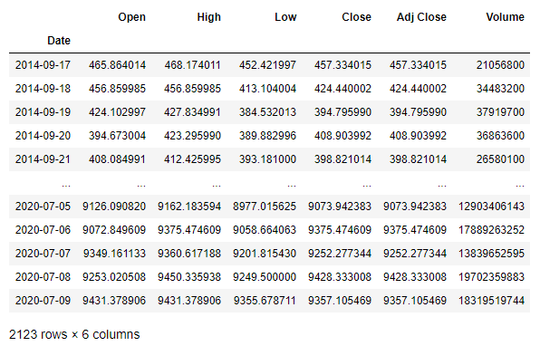

# Prediction bitcoin price from 2014 to 2020 with Gated Recurrent Unit (RNN)

## Introduction

&nbsp;&nbsp;&nbsp;&nbsp;&nbsp; In this project I created prediction model for predict bitcoin price with Gated Recurrent Unit Model. GRU is a gating mechanism in recurrent neural networks (RNN) similar to a long short-term memory (LSTM), GRU have more simple computation and faster than LSTM because have fewer number of gates.
   
&nbsp;&nbsp;&nbsp;&nbsp;&nbsp; Dataset used in this model prediction is bitcoin price from 2014 to 2020 were recorded every day. I obtained dataset from kaggle, you can check dataset in this link : https://www.kaggle.com/khalilbrick/bitcoin-data-from-2014-to-2020. Prediction results from the prediction model will evaluate with RMSE and MAPE, to find out how optimal that the prediction models.

## Results

&nbsp;&nbsp;&nbsp;&nbsp;&nbsp; Results from prediction model for predict bitcoin price with Gated Recurrent Unit Model is quite good, the model can predict bitcoin price well. The following is a model loss from model that  I built :

 
  
   
 Model loss

 
 &nbsp;&nbsp;&nbsp;&nbsp;&nbsp; Can be seen from the picture above, train and val loss are not fluctuating and overfitting, so it can be said the model prediction can predict bitcoin price quite well. After the model is compiled, that model will be implemented on test set which has been partitioned before.Then, evaluate the prediction model with RMSE and MAPE

 
  
   
 Root Mean Square Error and Mean Absolute Percentage Error

 
&nbsp;&nbsp;&nbsp;&nbsp;&nbsp; Based on the results obtained, the model is quite good in making predictions of bitcoin, with result of RMSE is 1994.7004 and MAPE is 18.5992% (Accuracy : 81.4%). After that, here is a table and graph from comparing the results of prediction with actual test data

 
 Table comparasion data actual and data prediction
    
 
    
  
    
 Graph comparasion data actual and data prediction
   

 
&nbsp;&nbsp;&nbsp;&nbsp;&nbsp; Can be seen from the graph, prediction results can can follow the movement from test set. But, there are some points of prediction result which is quite big different from the actual sets (for example at the first or initial data point).

---------------------------------------------------------------------------------------------------------------------------------------------------------------------------------

## Summary
The following is a summary of what was done in this project:

#### - Data Preprocessing

 
&nbsp;&nbsp;&nbsp;&nbsp;&nbsp; First, import some libraries that will be used and store data into dataframe

 
  
 
   
 Informations of data

 
&nbsp;&nbsp;&nbsp;&nbsp;&nbsp; Based on picture above, we know dataset contains 2123 rows data and 6 columns. It can be seen that the dataset is fairly clean and also has no null values. After that, I do features selection, features I used in this model prediction is ‘Date’ and ‘Close’ which can represent bitcoin price movements every day.

 
  
   
 Bitcoin price graph

 
&nbsp;&nbsp;&nbsp;&nbsp;&nbsp; Afterthat, I do min-max normalization and data partition. Dataset separated into 3 partitions that is training, validation and test sets with composision : 70% for training, 10% for validation and 20% test sets.

 
 
   
 Training data graph
   
  
   
 Validation data graph
   
  
   
 Test data graph

 
&nbsp;&nbsp;&nbsp;&nbsp;&nbsp; Afterthat, I change format dataset from sequential into sliding windows format. In this prediction model, I used the sliding windows with two lag or length.

  

#### Predict Bitcoin Price with Gated Recurrent Unit

 
&nbsp;&nbsp;&nbsp;&nbsp;&nbsp; Prediction model architecture that implemented in this task is model prediction with three gru layer. Each layer GRU have dropout layer(the dropout rate is set to 20%) which aims to prevent overfitting on model. Then, do some evaluating for determine best hyperparameter on that model. There are best hyperparameter I used in this model prediction :
- learning_rate = 0.0001
  
- hidden_unit = 64

- batch_size=256

- epoch = 100

- optimizers = adam

&nbsp;&nbsp;&nbsp;&nbsp;&nbsp; Here is the model loss from the prediction model: :

 
  
   
 Model loss

 
 &nbsp;&nbsp;&nbsp;&nbsp;&nbsp; Can be seen from the picture above, train and val loss are not fluctuating and overfitting, so it can be said the model prediction can predict bitcoin price quite well. After the model is compiled, that model will be implemented on test set which has been partitioned before.Then, evaluate the prediction model with RMSE and MAPE

 
  
   
 Root Mean Square Error and Mean Absolute Percentage Error Values

 
&nbsp;&nbsp;&nbsp;&nbsp;&nbsp; Based on the results obtained, the model is quite good in making predictions of bitcoin, with result of RMSE is 1994.7004 and MAPE is 18.5992% (Accuracy : 81.4%). After that, here is a table and graph from comparing the results of prediction with actual test data

 
 Table comparasion data actual and data prediction
    
 
    
  
    
 Graph comparasion data actual and data prediction
   

 
&nbsp;&nbsp;&nbsp;&nbsp;&nbsp; Can be seen from the graph, prediction results can can follow the movement from test set. But, there are some points of prediction result which is quite big different from the actual sets (for example at the first or initial data point).

For details you can check my code : [Prediction Bitcoin Price with Gated Recurrent Unit (RNN).ipynb](https://github.com/rifkyahmadsaputra/Prediction-Bitcoin-Price-with-Gated-Recurrent-Unit-RNN-/blob/master/Prediction%20Bitcoin%20Price%20with%20Gated%20Recurrent%20Unit%20%20(RNN).ipynb)

